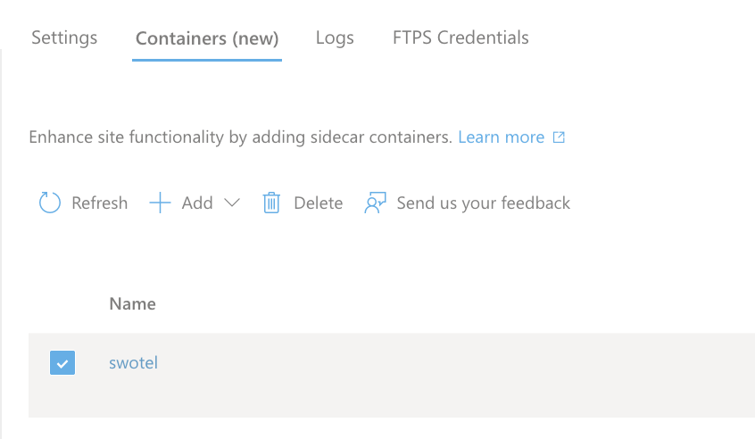
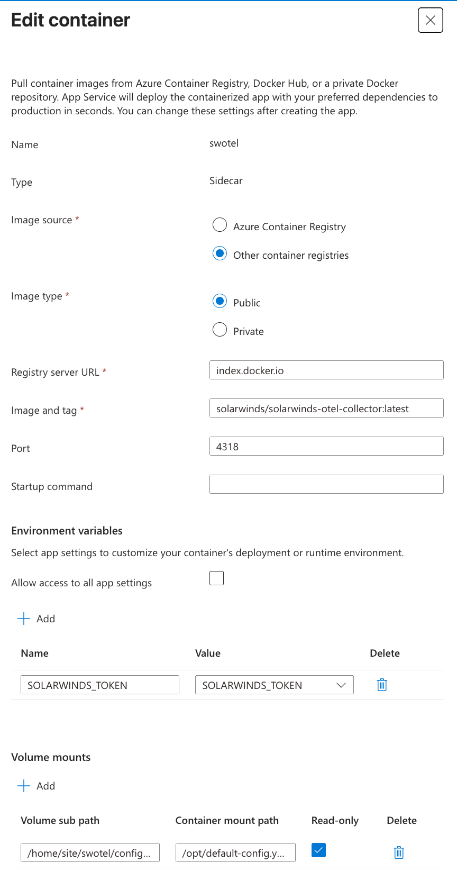

# Azure App Service Quickstart (PHP + SolarWinds APM)

This guide describes a working pattern for running `solarwinds/apm` on Azure App Service for Linux with a SolarWinds OpenTelemetry Collector sidecar.

## Why this setup is Azure-specific

App Service containers are replaceable. Files outside `/home` are not guaranteed to persist.

Keep these under `/home`:

- extension binaries (`.so`)
- PHP config files (`.ini`)
- collector config (`config.yaml`)

## 1. Regular PHP App Service

### Prerequisites

- Azure App Service for PHP
- SSH access to the app container
- `solarwinds/apm` added to your app `composer.json`
- `composer` and `pie` available in the container shell
- Azure Portal access to App Settings and Sidecars

### Step 1: Install extensions and persist them in `/home`

Install extensions with `pie`, copy them to a persistent directory, then uninstall the package-managed copies:

```bash
pie install open-telemetry/ext-opentelemetry
pie install solarwinds/apm_ext

mkdir -p /home/site/ext
cp "$(php -r 'echo ini_get("extension_dir");')/opentelemetry.so" /home/site/ext/
cp "$(php -r 'echo ini_get("extension_dir");')/apm_ext.so" /home/site/ext/

pie uninstall solarwinds/apm_ext
pie uninstall open-telemetry/ext-opentelemetry
```

Expected persistent layout:

```text
/home/site/ext/
  apm_ext.so
  opentelemetry.so
```

### Step 2: Create `.ini` files in `/home`

Create the directory and these files:

```text
mkdir -p /home/site/ini

/home/site/ini/apm_ext.ini
/home/site/ini/opentelemetry.ini
```

Use absolute paths:

```ini
; /home/site/ini/apm_ext.ini
extension=/home/site/ext/apm_ext.so
```

```ini
; /home/site/ini/opentelemetry.ini
extension=/home/site/ext/opentelemetry.so
```

### Step 3: Include `/home/site/ini` in `PHP_INI_SCAN_DIR`

In Azure App Settings:

```text
PHP_INI_SCAN_DIR=/usr/local/etc/php/conf.d:/home/site/ini
```

## 2. Add SolarWinds OTel Collector sidecar

### Step 1: Store collector config in `/home`

Use the SolarWinds collector [example config](https://github.com/solarwinds/solarwinds-otel-collector-releases/blob/main/examples/integrations/apm/config.yaml) and save it as:

```text
mkdir -p /home/site/swotel

/home/site/swotel/config.yaml
```

Set `collector_name` and `endpoint`:

```yaml
extensions:
  solarwinds:
    collector_name: <your-collector-name>
    grpc:
      endpoint: otel.collector.na-01.cloud.solarwinds.com:443
      tls:
        insecure: false
      headers: {"Authorization": "Bearer ${env:SOLARWINDS_TOKEN}", "swi-reporter": "otel solarwinds-otel-collector"}
```

### Step 2: Configure sidecar container

In Sidecar settings:

- mount `/home/site/swotel/config.yaml` to `/opt/default-config.yaml`
- set sidecar env var `SOLARWINDS_TOKEN` in Azure App Settings and reference it in the sidecar container env var `SOLARWINDS_TOKEN`





## 3. App Service environment variables

Set the application env vars in Azure App Settings:

- `SW_APM_SERVICE_KEY`
- `SOLARWINDS_TOKEN`
- `OTEL_SERVICE_NAME`
- `OTEL_PHP_AUTOLOAD_ENABLED=true`
- `OTEL_TRACES_SAMPLER=solarwinds_http`
- `OTEL_PROPAGATORS=baggage,tracecontext,swotracestate,xtraceoptions`
- `OTEL_EXPERIMENTAL_RESPONSE_PROPAGATORS=xtrace,xtraceoptionsresponse`
- `OTEL_EXPORTER_OTLP_METRICS_TEMPORALITY_PREFERENCE=delta`
- `OTEL_EXPORTER_OTLP_METRICS_DEFAULT_HISTOGRAM_AGGREGATION=base2_exponential_bucket_histogram`

## 4. Restart and validate

After applying settings, restart App Service and verify:

- `php --ri opentelemetry` shows extension loaded
- `php --ri apm_ext` shows extension loaded
- sidecar logs show healthy collector startup
- traces appear in SolarWinds Observability

## 5. WordPress variant (Azure App Service for WordPress)

For `appsvc/wordpress-debian-php`, setup is the same except for two differences:

1. `opentelemetry` extension is preinstalled in the base image.
2. Instrumentation is injected without changing WordPress app code.

### Step 1: Create a separate instrumentation project and run `composer install` in it.

Example `composer.json` (for example under `/home/site/otel`):

```json
{
  "name": "azure-app-service/instrument-azure-wordpress",
  "type": "project",
  "require": {
    "solarwinds/apm": "^9.0@alpha",
    "open-telemetry/api": "^1.7",
    "open-telemetry/detector-azure": "^0.2",
    "open-telemetry/opentelemetry-auto-wordpress": "^0.2",
    "symfony/http-client": "^8.1"
  },
  "config": {
    "allow-plugins": {
      "php-http/discovery": true,
      "tbachert/spi": true
    }
  }
}
```

### Step 2: Prepend autoloader via ini

```ini
; /home/site/ini/otel-autoload.ini
auto_prepend_file=/home/site/otel/vendor/autoload.php
```

Then keep the same `/home` persistence and sidecar pattern used for the regular PHP setup.
