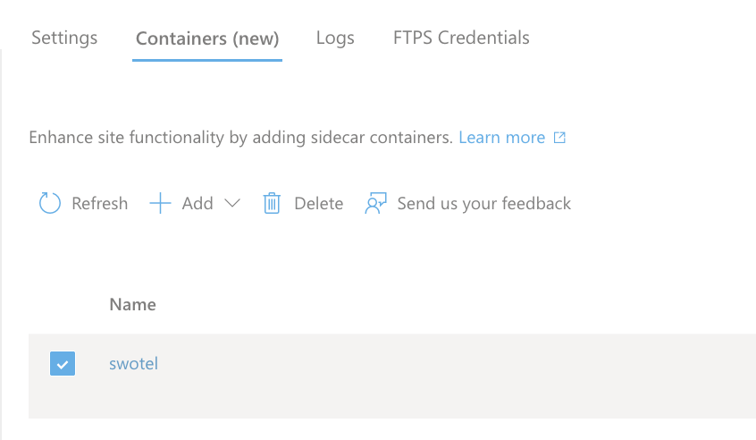
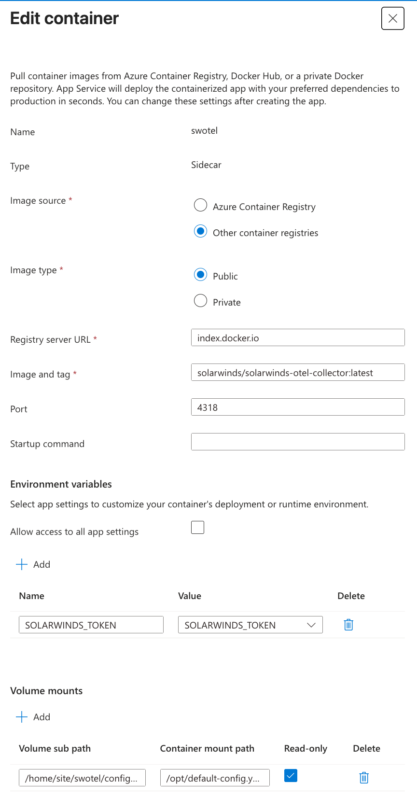

# Azure App Service Quickstart

This guide describes a working pattern to set up SolarWinds APM for a standard PHP project that uses Composer, and for WordPress on App Service. Only App Service on Linxux is supported.

> [!IMPORTANT]
> In App Service, files outside the `/home` directory are not guaranteed to persist. Keep these under `/home`:
>
> - extension binaries (`.so`)
> - PHP config files (`.ini`)
> - collector config (`config.yaml`)

After following the steps in this guide, the resulting `/home/site` directory structure should be:

```
/home/site
├── ini
│   ├── apm_ext.ini
│   └── opentelemetry.ini
├── swotel
│   └── config.yaml
└── wwwroot
    └── bin
        ├── apm_ext.so
        └── opentelemetry.so
```

The examples in this guide assume you have SSH access to the app container, and may require [Composer](https://getcomposer.org/) and [PIE](https://github.com/php/pie) to be available in the container shell.

# Standard PHP App Service

## Install SolarWinds APM

For the typical App Service deployment scenario where build automation is enabled (`SCM_DO_BUILD_DURING_DEPLOYMENT=true`),
add `solarwinds/apm` and a PSR-compatible HTTP client to your application's `composer.json`. Example from [README](../README.md#installation):

```bash
composer require solarwinds/apm:^9.0@alpha guzzlehttp/guzzle
```

For a deployment scenario where build automation is disabled, e.g. deploy via custom container image, your application must include all the installed dependencies in the container or deployable artifact.

## Install the OpenTelemetry and SolarWinds APM extensions

Add these extensions under the `/home` directory. The steps below demonstrate one way to do this, see https://learn.microsoft.com/en-us/azure/app-service/configure-language-php?pivots=platform-linux#enable-php-extensions for the full details.

> [!NOTE]
> The steps below should be performed in an SSH session in the app container.

Install extensions with `pie`, then copy them to `/home/site/wwwroot/bin`:

```bash
pie install open-telemetry/ext-opentelemetry
pie install solarwinds/apm_ext

mkdir -p /home/site/wwwroot/bin
cp "$(php -r 'echo ini_get("extension_dir");')/opentelemetry.so" /home/site/wwwroot/bin/
cp "$(php -r 'echo ini_get("extension_dir");')/apm_ext.so" /home/site/wwwroot/bin/
```

Uninstall the package-managed copies:
```bash
pie uninstall solarwinds/apm_ext
pie uninstall open-telemetry/ext-opentelemetry
```

Create extension INI files under `/home/site/ini` with absolute paths to the extensions:

```bash
mkdir -p /home/site/ini

echo 'extension=/home/site/wwwroot/bin/apm_ext.so' > /home/site/ini/apm_ext.ini
echo 'extension=/home/site/wwwroot/bin/opentelemetry.so' > /home/site/ini/opentelemetry.ini
```

The extensions will be enabled by the `PHP_INI_SCAN_DIR` app setting described in the [Enable](#enable) section.

## Configure

Environment variables supported by APM PHP can be set as app settings, in the Azure portal this is under Settings > Environment variables > App settings. These are the required settings:

| Name | Value |
| ---- | ----- |
| SW_APM_SERVICE_KEY | The service name portion, i.e. string after `:`, is ignored and the App Service app name (`WEBSITE_SITE_NAME`) is used as the SWO service name. To override with an explicit service name, set the `OTEL_SERVICE_NAME` variable. |
| SOLARWINDS_TOKEN | Set this to the same API Token portion used in `SW_APM_SERVICE_KEY`. |
| OTEL_TRACES_SAMPLER | `solarwinds_http` |
| OTEL_PROPAGATORS | `baggage,tracecontext,swotracestate,xtraceoptions` |
| OTEL_EXPERIMENTAL_RESPONSE_PROPAGATORS | `xtrace,xtraceoptionsresponse` |
| OTEL_EXPORTER_OTLP_METRICS_TEMPORALITY_PREFERENCE | `delta` |
| OTEL_EXPORTER_OTLP_METRICS_DEFAULT_HISTOGRAM_AGGREGATION | `base2_exponential_bucket_histogram` |

## Add the SolarWinds OpenTelemetry Collector as a sidecar

We recommend setting up the [SolarWinds OpenTelemetry Collector](https://documentation.solarwinds.com/en/success_center/observability/content/intro/otel/otel-collector.htm) as an [App Service sidecar](https://learn.microsoft.com/en-us/azure/app-service/overview-sidecar) to export telemetry in the background, which reduces latency on the instrumented app.

First, create a collector config file in the app container as `/home/site/swotel/config.yaml`. Use the [example SolarWinds OpenTelemetry Collector config file](https://github.com/solarwinds/solarwinds-otel-collector-releases/blob/main/examples/integrations/apm/config.yaml) content, set a `collector_name` and the `endpoint` that corresponds to your [tenant data center for OTLP](https://documentation.solarwinds.com/en/success_center/observability/content/system_requirements/endpoints.htm?#Find). Example snippet:

```yaml
extensions:
  solarwinds:
    collector_name: my-app-service-collector
    grpc:
      endpoint: otel.collector.na-01.cloud.solarwinds.com:443
      tls:
        insecure: false
      headers: {"Authorization": "Bearer ${env:SOLARWINDS_TOKEN}", "swi-reporter": "otel solarwinds-otel-collector"}
```

Now create the sidecar. This can be done in the Azure portal under Deployment Center > Containers. Add a "Custom container" sidecar with the following settings:

- Image source is Other container registries.
- Image type is Public.
- Registry server URL is `index.docker.io`.
- Image and tag is `solarwinds/solarwinds-otel-collector:latest`
- Port is 4318.
- Environment variables allow access to the `SOLARWINDS_TOKEN` app setting.
- Volumn mounts path `/home/site/swotel/config.yaml` to the container path `/opt/default-config.yaml` as read-only.





## Enable

Set these app setting environment variables to enable the extensions and auto-instruemntation:

| Name | Value |
| ---- | ----- |
| PHP_INI_SCAN_DIR  | `/usr/local/etc/php/conf.d:/home/site/ini`. This adds the path used in the [example](#install-the-opentelemetry-and-solarwinds-apm-extensions). |
| OTEL_PHP_AUTOLOAD_ENABLED | `true` |

# WordPress App Service

Auto-instrumentation depends on Composer which WordPress does not use. We'll demonstrate using PHP's [auto_prepend_file](https://www.php.net/manual/en/ini.core.php#ini.auto-prepend-file) directive to bootstrap from a separate project that contains the instrumentation dependencies.

## Create a separate instrumentation project and install its dependencies

> [!NOTE]
> The steps below should be performed in an SSH session in the WordPress app container, and require [Composer](https://getcomposer.org/) to be available.

Create a directory under `/home` (e.g. `/home/site/instrument`) to keep the separate project and add a `composer.json` file with the following content:

```json
{
  "name": "azure-app-service/instrument-azure-wordpress",
  "type": "project",
  "require": {
    "solarwinds/apm": "^9.0@alpha",
    "open-telemetry/api": "^1.7",
    "open-telemetry/detector-azure": "^0.2",
    "open-telemetry/opentelemetry-auto-wordpress": "^0.2",
    "symfony/http-client": "^8.1"
  },
  "config": {
    "allow-plugins": {
      "php-http/discovery": true,
      "tbachert/spi": true
    }
  }
}
```

Run `composer install` in this project directory and ensure the file `/home/site/instrument/vendor/autoload.php` is created.

Add an INI file under the customized `PHP_INI_SCAN_DIR` location used in this guide, `/home/site/ini`, that sets the auto_prepend_file value:

```bash
mkdir -p /home/site/ini

echo 'auto_prepend_file=/home/site/instrument/vendor/autoload.php' > /home/site/ini/instrument.ini
```

## Install extensions, configure, set up the sidecar and enable

Follow the same steps from [this section](#install-the-opentelemetry-and-solarwinds-apm-extensions) onward to complete the rest of the setup.

> [!NOTE]
> The OpenTelemetry extension is preinstalled in the `appsvc/wordpress-debian-php:8.4` WordPress image. Check with `php --ri opentelemetry`, if present you can skip installing it under `/home`.

# Restart and validate

After the install, configure and enable steps are done, restart the App Service and verify:

- `php --ri opentelemetry` shows the OpenTelemetry extension loaded.
- `php --ri apm_ext` shows the SolarWinds APM extension loaded.
- Sidecar logs show healthy collector startup.
- After the app handles a few requests, telemetry appear in SolarWinds Observability.